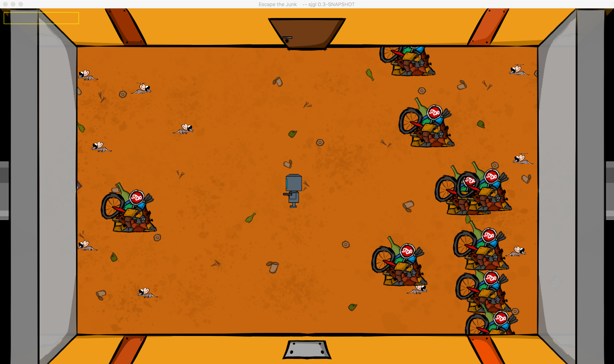

# Salty Engine

Salty Engine is a Java library for making a whole 2D Game with only one single library/engine. It aims to be the most user-friendly and easy-to-use 2D Game making tool for Java.  

### It isn't just a library for rendering
It also includes GameObject management, camera moving,
display management, support for hitboxes, input, and
resource management, but also support for scene and
stage management as well as saving with
stdf (github.com/edgelord314/stdf)

**NOTE: When you release a game that's made with Salty Engine, please [send me an email](mailto:malte.dostal@gmail.com)**

# Content
1. [Why using Salty Engine](#why-using-salty-engine)
2. [Build Instructions](#build-instructions)
3. [Games made with Salty Engine](#games-made-with-salty-engine)
4. [Collaborate](#collaborate)


# Why using Salty Engine?

### Pro:
- simple Display management
- have the game in a panel inside your own window
- easy rendering process with ```SaltyGraphics```
- GameObjects for the simplest game developing possible
- Scenes for collecting and defining what to render and update
- Layers which are pretty much the same as Scenes
- LayerCollections for having more than one Layer at once on the Screen,
  but if needed, moving each with a different speed
- linear Keyframe Animations
- Animations
- Spritesheets
- Resource management (inner as well as outer)
- Music and Sound
- UI with pre-defined elements like Buttons
- Components (behave like extensions to GameObjects)
- Collision detection with hitboxes
- A simple yet working physics engine
- Keyboard and mouse input as simple as possible for the developer
- JavaDoc for newer methods
- **examples for almost all of those features within the library** (```testing.Tester``` as main) 

### Contra: 
- the physics are too simple for some games (only rectangular hitboxes, no rotation by the physics...)
- no JavaDoc for older classes/method
- ...

# Build instructions
To get a usable JAR of this library, you can whether download an existing release [here](https://github.com/edgelord314/salty-engine/releases/) or build one yourself following these instructions:

1. Clone (download) the git repository. To do so, open up the terminal or cmd, go to any directory and type in 
   
   ```bash
   git clone https://github.com/edgelord314/salty-engine
   ``` 
   
   Of course, `git` has to be installed properly.
    
2. "cd" into the downloaded directory. Type 
   
   ```bash
   cd salty-engine
   ``` 
   
   into the cmd or terminal

3. Build the project using the maven wrapper (no installation required). 
   For windows, type the following into the cmd 
   
   ```bash
   ./mvnw.cmd clean install
   ```
   
   For Linux/macOs type the following into the terminal: 
   
   ```bash
   ./mvnw clean install
   ```
   
4. You can now whether use maven to get the lib into the buld path of your project (recommended) or use the built JAR directly.
   For maven, add the following to your `pom.xml`:
   
   ```xml
   <dependencies>
        <dependency>
            <groupId>de.edgelord.salty-engine</groupId>
            <artifactId>salty-engine</artifactId>
            <version>[the version you built in step 3]</version>
        </dependency>
    </dependencies>
   ``` 
   When you build the project as described in step 3, something like this should appear somewhere at the beggining of the output:
   
   ```bash
   [INFO] ---------------< de.edgelord.salty-engine:salty-engine >----------------
   [INFO] Building Salty Engine [the version (the -SNAPSHOT is important!)]
   [INFO] --------------------------------[ jar ]---------------------------------

   ```
   
   Or you copy the JAR `target/salty-engine-[version]-jar-with-dependencies.jar` relative to the directory of the cloned project and add it to the buildpath manually using your IDE.


# Games made with Salty Engine

### Escape the Junk
Made by edgelord and LoOoNeliEst for Ludum Dare 42. You can play it [here](https://ldjam.com/events/ludum-dare/42/escape-the-junk).


# Collaborate
Do you want to collaborate? Feel free to open a pull-request (preferably well documentated code!). Also, feel free to [join the official discord server](https://discord.gg/VW45ySv) <p>
If you want to get access to a comfortable and frequently updated TODO list of this project create a (free) [Wunderlist](https://www.wunderlist.com/) account and send me your username.

**Known bugs/glitches/issues**
- See in the ```Wunderlist``` TODO-List

**NOTE** for help with how to use, please check out the files in
src/main/java/testing and the [project wiki](https://github.com/edgelord314/salty-engine/wiki)
